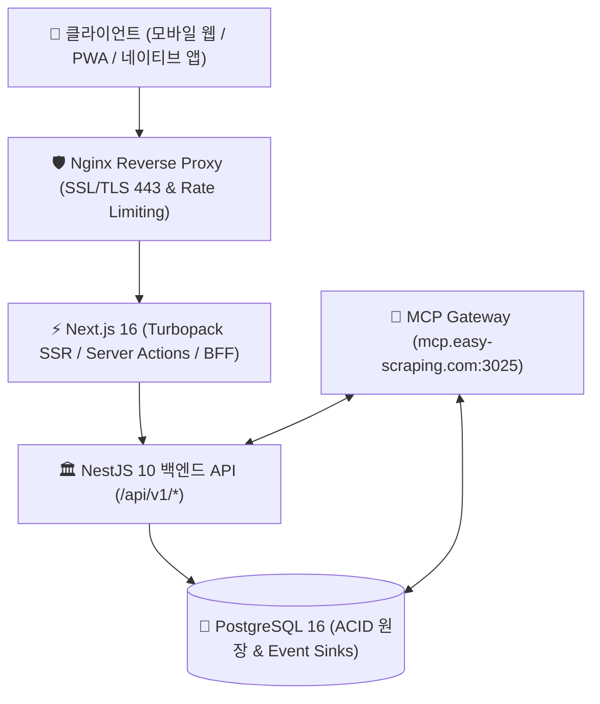
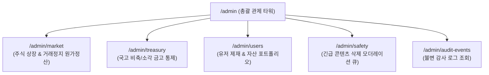

# 📱 월덕 머니버스(Woldeok Moneyverse) 통합 앱 명세서 및 상세 사용법 가이드

> **문서 버전**: `v2026.09.22.343`  
> **기준 커밋**: `3de891b` (최신 main)  
> **공식 프로덕션 도메인**: [https://easy-scraping.com](https://easy-scraping.com)  
> **테스트 스테이징 도메인**: [https://test.easy-scraping.com](https://test.easy-scraping.com)  
> **원격 제어 및 MCP 게이트웨이**: [https://mcp.easy-scraping.com](https://mcp.easy-scraping.com)

---

## 1. 개요 및 시스템 아키텍처

월덕 머니버스(Woldeok Moneyverse)는 가상 경제, 금융, 주식 거래소, 카지노 7대 게임, 직업/사업체, 협동조합, 소셜 커뮤니티가 하나로 통합된 차세대 핀테크 시뮬레이션 웹·앱 플랫폼입니다.

### 핵심 설계 표준
- **비(非)AI 인간 디자이너 크래프트맨십**: Toss, Robinhood, Apple 디자인 철학을 계승하여 군더더기 없는 타이포그래피, 고대비 모노스페이스 수치 표현, 44px 이상 터치 타깃, 320px~1440px 가로 스크롤 제로(Zero Horizontal Overflow) 반응형 레이아웃 보장.
- **원자적 원장 불변성**: 모든 재화 이동(송금, 거래정지 환급, 카지노 정산)은 PostgreSQL 트랜잭션과 멱등키(`idempotencyKey`)로 보호되어 중복 차감 및 위변조가 원천 차단됩니다.
- **다계층 보안 가드**: 관리자 콘솔과 중요 금융 변경은 6자리 TOTP 스텝업(Step-Up 2FA) 인증 및 300초 세션 로테이션 창을 강제합니다.

---

## 2. 앱 화면 구조 및 네비게이션 체계

### 2.1 하단 5대 고정 탭 (Mobile Bottom Navigation)
스마트폰 세로 모드(320px ~ 430px) 기준, 엄지손가락으로 손쉽게 조작할 수 있는 5개 핵심 탭을 제공합니다.

1. **홈 (`/`)**: 종합 자산 대시보드, 24시간 WLD 유통 지표, 퀵 실행 그리드, 출석 체크.
2. **경제 (`/bank`, `/stocks`, `/work`, `/businesses`, `/shop`)**: 은행 저축 포켓, 가상 주식 거래소, 직업 업무, 사업체 인수, 상점.
3. **카지노 (`/casino`)**: 7대 정규 게임(코인, 홀짝, 주사위, 하이로우, 보물상자, 젬, 룰렛휠) 및 실시간 잭팟 풀.
4. **소셜 (`/board`, `/gallery`, `/chat`, `/clubs`, `/newspaper`)**: 커뮤니티 게시판, 사진 갤러리, 1:1 쪽지, 협동 클럽, 주간 경제 브리프.
5. **MY (`/account`, `/account/notifications`, `/account/safety`)**: 내 프로필, 보안 세션 관리, 알림함 설정, 연령 확인, 회원 탈퇴.

### 2.2 상단 전역 셸 (Global Masthead)
- **실시간 핀테크 티커 바**: 상단에 WLD 통화량, 인플레이션 지수, 주요 종목 변동률을 실시간 전광판 형식으로 롤링 표시.
- **상태 배지 버튼**:
  - `쪽지 (Chat)`: 안읽은 1:1 메시지 수 배지 표시 및 원클릭 대화창 열기.
  - `알림 (Bell)`: 보안/거래/활동 알림 수 배지 표시 및 알림 센터 열기.
  - `프로필 허브`: 내 계정 잔액 및 원터치 로그아웃 드롭다운.

---

## 3. 일반 사용자 기능별 상세 화면 사용법 (Step-by-Step)

### 3.1 계정 가입, 로그인 및 세션 보안 (`/login`, `/register`, `/account`)
1. **회원가입**: 이메일 주소, 닉네임, 비밀번호(영문/숫자/특수문자 포함 8자 이상)를 입력하고 이용약관 및 개인정보처리방침에 동의합니다.
2. **이메일 인증**: 가입 즉시 발송된 6자리 인증 코드를 입력하여 계정을 활성화합니다.
3. **활성 기기 세션 관리 (`/account/security/sessions`)**:
   - 현재 로그인된 스마트폰, PC 브라우저 목록(기기명, IP, 최근 접속 시각)을 확인합니다.
   - 의심스러운 접속이 발견되면 해당 기기를 선택하여 즉시 원격 로그아웃시키거나, `모든 기기에서 로그아웃`을 실행할 수 있습니다.

---

### 3.2 홈 대시보드 및 일일 출석 (`/`)
1. **내 순자산 위젯**: 지갑 현금(WLD), 저축 포켓 잔액, 주식 평가액, 보유 사업체 자산이 합산된 총자산이 실시간 업데이트됩니다.
2. **원터치 퀵 서비스 아이콘 그리드**: 직업 출근, 주식 주문, 저축 입금, 휠 스핀, 쪽지함으로 즉시 점프합니다.
3. **일일 보상 수령**: 매일 00:00(자정) KST 기준으로 초기화되는 출석 보상을 원클릭으로 지갑에 입금받습니다.

---

### 3.3 금융 센터: 은행 5대 탭 및 저축 포켓 (`/bank`)
머니버스 은행은 현실 핀테크 앱 수준의 5대 서피스로 분리 구성되어 있습니다.

#### ① 저축·목표 포켓 (Saving Pockets) 사용법
- **포켓 만들기**: `새 저축 포켓` 버튼 클릭 -> 포켓 이름(예: "내 집 마련", "비상금"), 목표 금액, 목표 날짜, 테마 색상(민트, 스카이, 골드, 에메랄드)을 선택하여 생성합니다.
- **수수료 0원 즉시 이체**: 유동 지갑 잔액을 저축 포켓으로 입금(`DEPOSIT`)하거나, 포켓 잔액을 유동 지갑으로 출금(`WITHDRAW`)할 수 있으며 본인 계좌 간 이동이므로 수수료는 **0 WLD**입니다.
- **포켓 꾸미기 & 아카이브**:
  - 테마 색상 변경: 100 WLD가 경제 하드 소각처(`HARD_SINK`)로 회수되며 포켓 스타일이 변경됩니다.
  - 목표 달성 아카이브: 목표를 달성한 포켓은 500 WLD 소각 후 명예 전당에 영구 보관되며, 잔액은 유동 계정으로 전액 환급됩니다.

#### ② 가상 국채 카탈로그 (Bonds) 사용법
- 만기 7일/30일/90일 가상 국채를 매수하여 확정 연이율(APR)에 따른 이자를 수령할 수 있습니다.
- 만기 도래 시 원리금이 자동 정산되며, 급전이 필요할 경우 중도 환매가 가능합니다.

#### ③ 스마트 대출 (Credit & Loans) 사용법
- 신용 등급에 따라 산정된 한도 내에서 긴급 자금을 대출받고, 일일 이자 및 원금을 원하는 분할 회차로 상환할 수 있습니다.

---

### 3.4 가상 주식 거래소 및 거래정지 자동정산 (`/stocks`)
1. **호가창 및 차트 분석**: 실시간 캔들 차트, 5단계 매수/매도 호가 잔량, 체결 틱을 확인합니다.
2. **주문 접수**:
   - `매수 (BUY)`: 원하는 주가와 수량을 입력하고 주문을 넣습니다. 체결 즉시 지갑에서 WLD가 차감되고 보유 주식으로 반영됩니다.
   - `매도 (SELL)`: 보유 주식을 매도하여 WLD를 확보합니다.
3. **종목 토론 및 목표가 알림**:
   - 종목 상세 페이지 하단 토론 탭에서 주주들과 의견을 교환합니다.
   - 목표가(예: 1,500 WLD 돌파 시)를 설정해 두면 인앱 알림을 실시간으로 수신합니다.
4. **🛡️ 주식 거래정지 매수원가 자동환급 보호 (투자자 보호 장치)**:
   - 특정 종목이 부정 행위나 관리자 심의로 거래정지(`HALTED`)되는 경우, **시세 급락에 따른 손실 없이 본인이 매수한 실제 원가(Cost Basis)가 100% WLD로 자동 전액 환급**됩니다.
   - 거래정지 정산 시 매매수수료 및 세금은 0%로 전액 면제됩니다.

---

### 3.5 직업(근무) & 사업체 경영 (`/work`, `/businesses`)
1. **직업 근무 (`/work`)**:
   - 광부, 프로그래머, 트레이더, 연구원 등 카탈로그에서 직업을 선택합니다.
   - `업무 시작` 버튼을 누르면 10초 타이머가 작동하며, 모바일 화면 자동 포커싱을 통해 완료 즉시 WLD 보상과 숙련도 경험치를 수령합니다.
   - 일일 업무 수행 한도(Cap) 게이지를 통해 잔여 가능 횟수를 실시간 확인합니다.
2. **사업체 경영 (`/businesses`)**:
   - 편의점, IT 벤처, 운송업 등 사업체를 인수하고 매일 발생하는 운영 수익을 정산받습니다.
   - 라이선스 갱신 및 마케팅 부스트를 적용하여 일일 수익률을 극대화할 수 있습니다.

---

### 3.6 카지노 7대 정규 게임 & 룰렛 휠 스핀 (`/casino`)

#### 🛡️ 자가 보호(책임도박) 한도 설정 (필수 권장)
- 카지노 메인 상단의 `책임도박 설정` 버튼을 통해 **일일 최대 베팅액 한도**와 **일일 손실 차단 한도**를 직접 설정할 수 있습니다. 한도 도달 시 당일 모든 카지노 게임 베팅이 자동 차단됩니다.

#### 🎰 7대 정규 게임 카탈로그 및 룰

| 게임명 | 게임 코드 | 선택지 | 확률 / 배당 | 게임 특징 및 조작법 |
| :--- | :---: | :---: | :---: | :--- |
| **동전 뒤집기** | `coin` | 앞면 / 뒷면 | 50% / **1.90x** | 초고속 1초 승부. 퀵 베팅 버튼 지원. |
| **주사위 홀짝** | `dice_parity` | 홀수 / 짝수 | 50% / **1.90x** | 1~6 주사위 눈의 홀/짝 예측. |
| **주사위 숫자** | `dice_number` | 1 ~ 6 중 택1 | 16.67% / **5.70x** | 6개 번호 중 정확한 눈 하나를 적중. |
| **하이 / 로우 20** | `hilo_20` | 로우(1~10) / 하이(11~20) | 50% / **1.90x** | 1~20 난수 중 절반 구간 예측. |
| **보물 상자** | `treasure_4` | 1 ~ 4번 상자 | 25% / **3.80x** | 4개의 황금 상자 중 보물이 든 상자 적중. |
| **럭키 젬** | `gem_5` | 5색 보석 중 택1 | 20% / **4.75x** | 루비/에메랄드/사파이어/토파즈/자수정 매칭. |
| **20구획 룰렛 휠** | `wheel_20` | 블루 / 골드 / 바이올렛 | 50%(**1.90x**) 25%(**3.80x**) 10%(**9.50x**) | **3.2초 SVG 감속 스핀 애니메이션** 및 최근 10회 히스토리 스트립 제공. 중립 3칸(꽝). |

- **실시간 잭팟 풀 티커**: 게임 화면 상단에 누적되는 황금 잭팟 풀 수치가 실시간 롤링되며, 대박 당첨 시 축하 파티클이 표시됩니다.
- **퀵 베팅 프리셋**: `[+1,000]`, `[+5,000]`, `[+10,000]`, `[최대 베팅]` 버튼으로 모바일 터치 한 번에 금액을 입력할 수 있습니다.

---

### 3.7 소셜 커뮤니티 & 1:1 비공개 쪽지함 (`/board`, `/chat`)
1. **1:1 비공개 쪽지 (`/chat`)**:
   - 원하는 사용자의 프로필에서 `쪽지 보내기`를 누르면 암호화된 1:1 대화방이 개설됩니다.
   - 3초 폴링 및 한글 IME 중복 전송 방지가 적용되어 매끄러운 모바일 채팅이 가능합니다.
   - 불쾌한 메시지를 수신한 경우 대화방 우측 상단 메뉴에서 `차단`, `음소거`, 또는 `증거 첨부 신고`를 즉시 진행할 수 있습니다.
2. **게시판 및 갤러리 (`/board`, `/gallery`)**:
   - 모바일 사진 업로드 시 브라우저 단에서 매직바이트를 사전 검증하고 최적 압축하여 빠르게 게시물을 공유합니다.

---

### 3.8 보안·거래 알림 거버넌스 인박스 (`/account/notifications`)
1. **인앱 알림함 탭**:
   - `TRANSACTIONAL`: 주식 거래정지 환급, WLD 멱등 송금/충전 영수증.
   - `SECURITY_CRITICAL`: 새 기기 로그인, 비밀번호 변경, 계정 잠금 안내.
   - 상단의 `모두 읽음` 버튼을 누르면 안읽은 배지가 즉시 소거됩니다.
2. **수신 동의 설정 탭**:
   - 서비스 운영 점검, 퀘스트/직업 활동, 시즌 소식, 마케팅 프로모션 알림을 개별적으로 ON/OFF 토글할 수 있습니다.
   - *단, 보안 및 금융 거래 알림(`SECURITY_CRITICAL`, `TRANSACTIONAL`)은 필수 고지 항목(`REQUIRED_SERVICE`)으로 사용자 보호를 위해 항상 수신됩니다.*

---

### 3.9 미성년자 안전 센터 & 공개 긴급 콘텐츠 삭제 (`/safety`)
머니버스는 아동·청소년 보호 및 글로벌 TAKE IT DOWN Act 규정을 철저히 준수합니다.

1. **비회원 공개 긴급 콘텐츠 삭제 접수 (`/safety/takedown`)**:
   - 회원 가입이나 로그인 없이도 피해자 본인 또는 법정대리인이 무단 촬영물, 유해 게시물, 개인정보 유출 콘텐츠의 URL을 입력하여 24시간 긴급 삭제를 요청할 수 있습니다.
   - 접수 시 본인 확인용 **비밀번호**를 설정합니다.
2. **긴급 삭제 처리 상태 조회 (`/safety/takedown/status`)**:
   - 접수 후 발급된 고유 번호(예: `TKD-20260922-4912`)와 비밀번호를 입력하면, 관리자의 검토 및 조치 상태(`접수됨` -> `조치 완료(삭제됨)`)를 안전하게 비공개로 실시간 조회할 수 있습니다.
3. **계정 연령 상태 확인 (`/account/safety`)**:
   - 대한민국 기준 만 14세 미만(`child_restricted`) 계정은 카지노 기능 및 마케팅성 상업 광고가 원천 차단됩니다.

---

## 4. 관리자(운영자) 관제 타워 사용 가이드 (`/admin`)

관리자 관제 타워는 최고관리자(`superadmin`) 및 운영자(`operator`) 권한을 가진 계정만 접근할 수 있는 엔터프라이즈급 통제 센터입니다.

### 4.1 콘솔 세션 로테이션 및 Step-Up 2FA
- `/admin`에 접근하면 `POST /api/v1/admin/security/sessions`를 통해 세션이 즉시 로테이션되며, 300초(5분) 동안 유효한 고보안 콘솔 세션이 활성화됩니다.
- 회원 제재, 주식 거래정지, 가격 임의 조정, 국고 자금 조작 등 **고위험 작업 실행 시 반드시 6자리 TOTP 2FA 인증 코드를 입력**해야만 데이터베이스 함수가 승인됩니다.

### 4.2 주식 거래정지 및 자동정산 단행 (`/admin/market`)
1. 관리자 마켓 콘솔에서 대상 종목의 `거래정지 및 정산` 버튼을 클릭합니다.
2. 사유를 입력하고 TOTP 2FA 코드를 입력한 후 확인을 누릅니다.
3. 백엔드 상태머신이 `ACTIVE -> HALTING -> HALTED_SETTLING -> HALTED_SETTLED`로 전환되며, 모든 보유자에게 매수원가가 100% 즉시 환급됩니다.
4. 만약 네트워크 일시 장애로 정산이 지연된 계정이 있을 경우, `정산 재처리(Retry)` 버튼을 눌러 멱등하게 전원 정산을 완결합니다.

### 4.3 국고 금고 통제 (`/admin/treasury`)
- **3대 시스템 금고 현황 모니터링**:
  - `외환/통화 안정 비축 금고 (RESERVE_STABILIZATION)`
  - `주식 거래정지 환급 전용 금고 (STOCK_HALT_RESERVE)`
  - `경제 소각처 회수 금고 (HARD_SINK_VAULT)`
- 통화량(M2) 과잉 시 유통 자금을 흡수 소각하거나, 유동성 위기 시 안정 자금을 시장에 주입할 수 있습니다.

### 4.4 긴급 콘텐츠 삭제 처리 (`/admin/safety`)
- 비회원 및 이용자가 접수한 긴급 삭제 요청 큐를 우선순위(성착취물, 협박, 유출 등) 순으로 검토합니다.
- 증거를 확인한 후 `삭제 조치(ACTIONED_REMOVED)` 또는 `반려(REJECTED)` 버튼을 눌러 즉시 사이트에서 블라인드 및 영구 삭제 처리합니다.

---

## 5. 자주 묻는 질문 (FAQ) 및 문제 해결 (Troubleshooting)

### Q1. 로그인 후 "세션이 만료되었습니다" 메시지가 뜹니다.
- 머니버스는 다중 보안 정책상 15분 이상 아무런 입력이 없거나 IP 대역이 급격히 변경되면 세션을 안전하게 보호하기 위해 자동 만료시킵니다.
- 재로그인하시면 이전에 작업 중이던 데이터는 100% 안전하게 보존되어 있습니다.

### Q2. 카지노 휠 게임에서 네트워크가 끊기면 베팅 금액은 어떻게 되나요?
- 베팅 버튼을 누르는 순간 서버 권위적(Authoritative) 암호학적 난수 생성기가 즉시 결과를 확정하고 원장에 기록합니다.
- 네트워크가 끊겨 애니메이션을 보지 못하더라도, 재접속 시 지갑 잔액과 카지노 이용 내역에 정산 결과가 100% 정확하게 반영되어 있습니다.

### Q3. 주식이 갑자기 거래정지되었는데 제 투자금은 어떻게 되나요?
- 머니버스는 거래정지된 종목의 보유 주식을 당시 시세가 아닌 **내가 실제로 구매했던 매수원가(Cost Basis)**를 기준으로 100% WLD 전액 자동 환급해 드립니다.
- 환급 내역은 `/account/notifications` 알림함 및 `/bank` 명세서에서 즉시 확인하실 수 있습니다.

### Q4. 모바일 화면에서 가로 스크롤이 생기거나 버튼이 잘립니다.
- 본 플랫폼은 320px 극소 모바일 화면까지 완벽하게 지원하는 반응형 엔진이 탑재되어 있습니다.
- 브라우저 확대 배율이 100%인지 확인해 주시고, 문제가 지속될 경우 캐시 새로고침(Ctrl + F5 또는 앱 새로고침)을 진행해 주세요.
